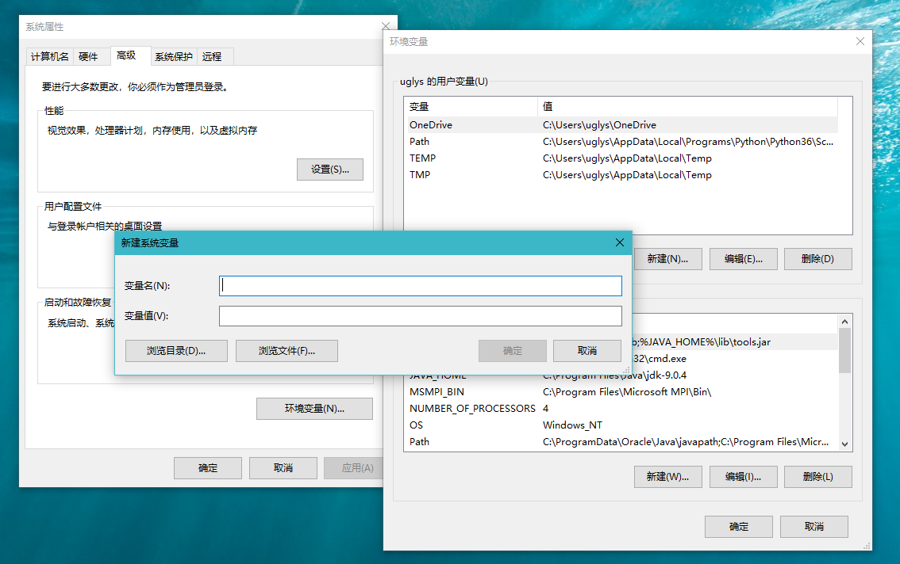
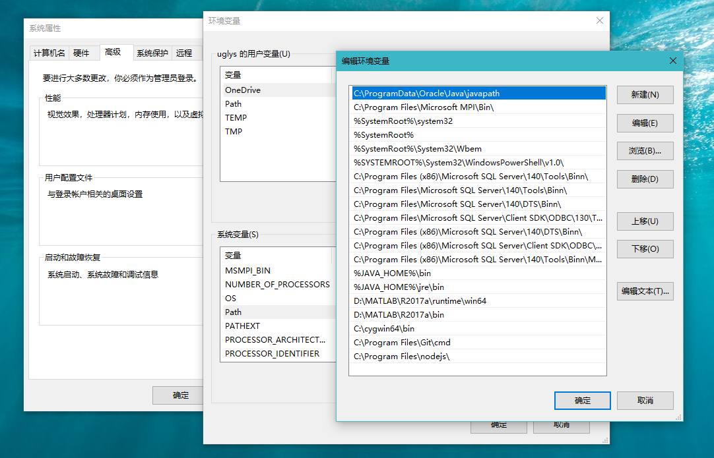

## 首先

下载 ***[Eclipse](https://www.eclipse.org/downloads/eclipse-packages/)*** 和 ***[Java](http://www.oracle.com/technetwork/java/javase/downloads/index.html)***

### 安装 *Eclipse*

解压下载到本地的 ***Eclipse*** 压缩包将压缩包放在你喜欢的路径下面，运行 ***eclipse.exe*** 文件

### 安装 *Java*

运行下载到本地的 ***Java*** 安装包，按照安装向导选择喜欢的路径进行安装

## 配置 *Java* 环境变量

### *JAVA_HOME*

***JAVA_HOME*** 指定的是 ***Java JDK*** 的安装目录路径

在 **系统属性** 面板中点击左上角的 **高级系统设置** ，之后再点击右下角的 **环境变量** 在 **系统变量** 下点击 **新建**

在 **变量名** 中输入 ***JAVA_HOME***

在 **变量值** 中输入 ***Java JDK*** 的安装目录路径，如

***C:\Program Files\Java\jdk-x.x.x***

点击 **确定** 完成创建

### *Path*

***Path*** 使得系统可以在任何路径下识别 ***Java*** 命令

在 **系统变量** 中找到 ***Path*** ，点击 **编辑** 之后再点击 **新建**

添加 ***%JAVA_HOME%\bin*** 和 ***%JAVA_HOME%\jre\bin*** 两条环境变量，点击确定完成添加

### *CLASS_PATH*

 ***CLASS_PATH*** 为 ***Java*** 加载类 ***(class or lib)*** 的路径，只有类在 ***CLASS_PATH*** 中，***java*** 命令才能识别这些类

在 **系统变量** 下点击 **新建**

在 **变量名** 中输入 ***CLASS_PATH***

在 **变量值** 中输入

***.;%JAVA_HOME%\lib;%JAVA_HOME%\lib\tools.jar***

点击 **确定** 完成创建

### 验证配置成功与否

在 ***CMD*** 中键入 ***java*** 有如下显示

键入 ***javac*** 有如下显示

则配置成功，否则请检查哪里出错或者重新再配置一遍

## 关联 *Java* 源码

打开 ***Eclipse*** ，在 ***Windows > Preference > Java*** 下点击 ***Install JREs***

点击 ***jre-9.0.4 ...*** ，再点击右边的 ***Edit***

点击 ***C:\Program Files\Java\jre-9.0.4\lib\jrt-fs.jar*** ，再点击右边的 ***Source Attachment***

点击 ***External location*** ，再点击 ***External File ...*** ，在你前面安装 ***Java*** 的路径下找到 ***src.zip*** 文件。如

***C:/Program Files/Java/jdk-9.0.4/lib/src.zip***

点击 ***OK*** 完成关联，之后在你调用 ***Java*** 内置函数时就可以通过 **按住 *Ctrl* 键的同时点击函数名** 的方式来查看源码和相关函数说明

