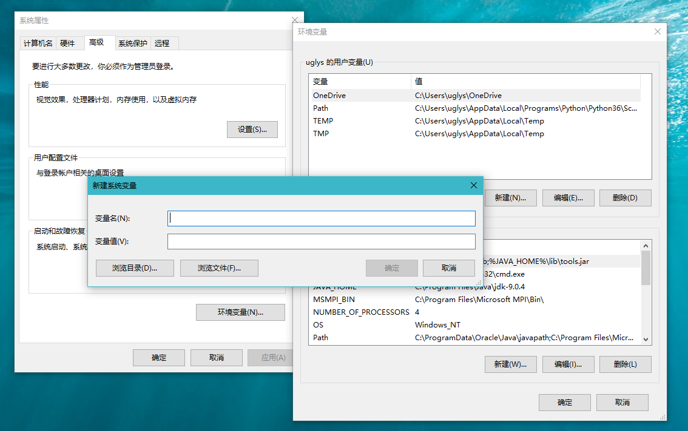
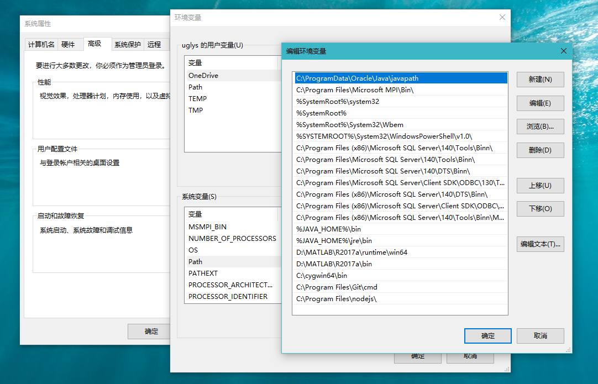

### *JAVA_HOME*

***JAVA_HOME*** 指定的是 ***Java JDK*** 的安装目录路径

在 **系统属性** 面板中点击左上角的 **高级系统设置** ，之后再点击右下角的 **环境变量** 在 **系统变量** 下点击 **新建**

在 **变量名** 中输入 ***JAVA_HOME***

在 **变量值** 中输入 ***Java JDK*** 的安装目录路径，如

***C:\Program Files\Java\jdk-x.x.x***

点击 **确定** 完成创建

### Path

***Path*** 使得系统可以在任何路径下识别 ***Java*** 命令

在 **系统变量** 中找到 ***Path*** ，点击 **编辑** 之后再点击 **新建**

添加 ***%JAVA_HOME%\bin*** 和 ***%JAVA_HOME%\jre\bin*** 两条环境变量，点击确定完成添加

### CLASS_PATH

 ***CLASS_PATH*** 为 ***Java*** 加载类 ***(class or lib)*** 的路径，只有类在 ***CLASS_PATH*** 中，***java*** 命令才能识别这些类

在 **系统变量** 下点击 **新建**

在 **变量名** 中输入 ***CLASS_PATH***

在 **变量值** 中输入

***.;%JAVA_HOME%\lib;%JAVA_HOME%\lib\tools.jar***

点击 **确定** 完成创建

### 验证配置成功与否

在 ***CMD*** 中键入 ***java*** 有如下显示

键入 ***javac*** 有如下显示

则配置成功，否则请检查哪里出错或者重新再配置一遍

